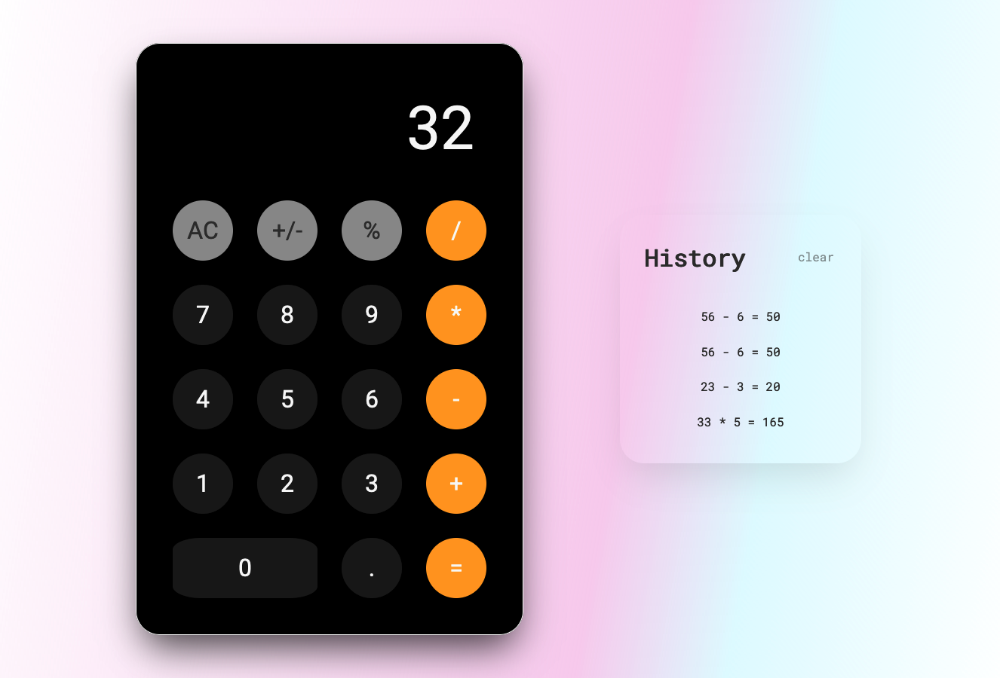

# Calculator

## Description

A simple calculator app that stores your history. You can use the keys on your keyboard to enter operations as well as the buttons.



### How to use

- 1-9 keys translate to numbers on keyboard
- +-\*/ translate to associated operations
- Enter submits the calculation
- Esc clears the calculator (not the history).

### How it works

- Calculatios are done on the server (see server.ts)
- `npm run dev` runs ts-node
- Server validates an array of strings that contain digits and operators i.e. `['3', '+', '33']` that is sent by the client
- The history is stored in an object on the server, once the server restarts history will be lost.

### Running on your machine

```bash
git clone https://github.com/michael-duren/calculator.git
cd calculator
npm install
npm run dev
```
